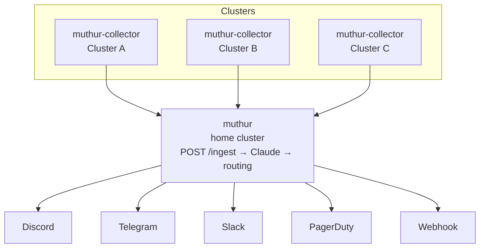

<p align="center">
  
</p>

# muthur

AI-powered Kubernetes monitoring server. Named after MU/TH/UR 6000 from Alien.

Receives enriched alert payloads from [muthur-collector](https://github.com/VojtechPastyrik/muthur-collector) instances, evaluates them with Claude, deduplicates, and routes notifications to configured receivers.



## Features

- **Claude-powered root cause analysis** — structured JSON output with evidence and recommended action
- **AlertManager-style receivers** — multiple named receivers, any number of each type (Discord, Telegram, Slack, PagerDuty, webhook)
- **File-mounted secrets** — sensitive values come from Kubernetes Secrets mounted as files, never env vars (safer against `/proc`, ps, crash dump leakage)
- **Flexible routing** — first-match rules by severity, cluster_id, alert_name, namespace
- **Per-cluster authentication** — each collector carries its own token; muthur validates both token and cluster_id
- **Deduplication** — SHA256-keyed sliding window, configurable TTL
- **AlertManager silence integration** — Claude can request auto-silences for known transient alerts
- **Grafana deep links** — every notification includes an Explore link pre-filtered to the alert's namespace and pod
- **No emoji ever** — plain text output only

## Prerequisites

- Go 1.26+
- protoc + protoc-gen-go
- Helm 3
- Anthropic API key

## Quick start (local dev)

```bash
make proto

cp .env.example .env
# Fill in ANTHROPIC_API_KEY, at least one COLLECTOR_TOKEN_*, and MUTHUR_CONFIG_FILE
make dev
```

Example `muthur.yaml` config file (the config file referenced by `MUTHUR_CONFIG_FILE`):

```yaml
receivers:
  - name: my-discord
    type: discord
    config:
      webhook_url_file: /secrets/receivers/my-discord-webhook

routing:
  rules:
    - name: all
      match: {}
      receivers: [my-discord]
```

Any config key ending in `_file` is resolved as a path to a file containing the real value — typically a mounted Kubernetes Secret. The file contents (trimmed of trailing whitespace) replace the value at runtime. Fields without `_file` suffix are used literally.

## Deploy via Helm

```bash
helm repo add vojtechpastyrik https://vojtechpastyrik.github.io/charts
helm repo update

helm install muthur vojtechpastyrik/muthur \
  --namespace muthur --create-namespace \
  -f my-values.yaml
```

See [`helm/muthur/README.md`](helm/muthur/README.md) for the full chart reference.

## Receivers and routing

muthur uses an AlertManager-style receiver model. Define named receivers with per-instance config, then reference them from routing rules. You can have multiple receivers of the same type — e.g. one Discord webhook for ops and another for dev.

In the Helm values, each receiver has two sections:

- `config` — literal non-sensitive fields (e.g. `chat_id`)
- `secretKeys` — map of field name → Secret key name; the chart mounts the Secret value as a file and muthur reads it at runtime

```yaml
receivers:
  - name: ops-telegram
    type: telegram
    config:
      chat_id: "-100123456"
    secretKeys:
      token: ops-telegram-token

  - name: critical-discord
    type: discord
    secretKeys:
      webhook_url: critical-discord-webhook

  - name: dev-discord
    type: discord
    secretKeys:
      webhook_url: dev-discord-webhook

routing:
  rules:
    - name: prod-critical
      match:
        severity: critical
        cluster_id: cluster-prod
      receivers: [ops-telegram, critical-discord]
    - name: dev-warnings
      match:
        severity: warning
        cluster_id: cluster-dev
      receivers: [dev-discord]
```

Secrets are provisioned via External Secrets Operator (for production) or inline `devSecrets.receiverSecrets` (for local dev). The chart mounts them at `/secrets/receivers/<key>` and the ConfigMap renders `<field>_file: /secrets/receivers/<key>` in each receiver config.

## License

MIT
