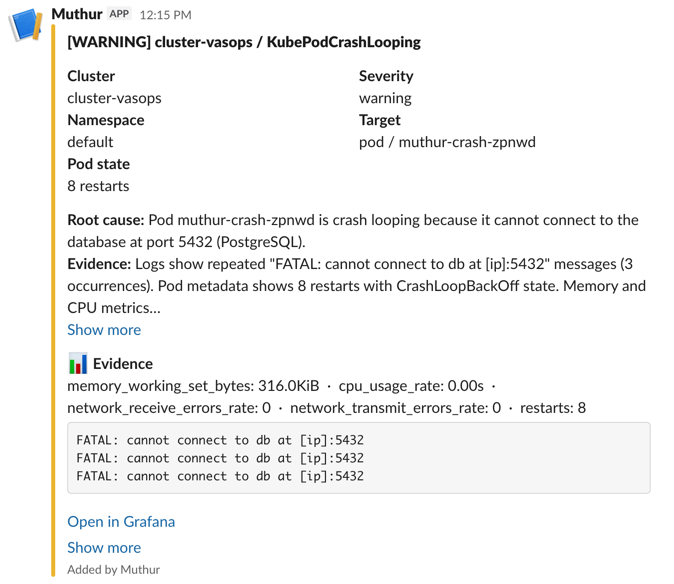
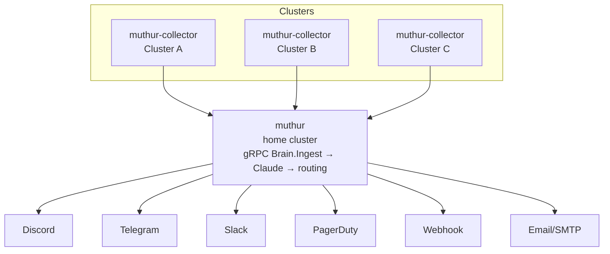

<p align="center">
  
</p>

# muthur

AI-powered Kubernetes monitoring server. Named after MU/TH/UR 6000 from Alien.

Receives enriched alert payloads from [muthur-collector](https://github.com/VojtechPastyrik/muthur-collector) instances, evaluates them with Claude, deduplicates, and routes notifications to configured receivers.

<sub>**Keywords:** AI-powered Kubernetes alerting · Claude / Anthropic AlertManager integration · LLM incident root cause analysis · AIOps · SRE on-call · observability · self-hosted · Prometheus · Loki · Grafana · Discord / Slack / Telegram / PagerDuty / email notifications.</sub>

<p align="center">
  
</p>
<p align="center"><sub>A real <code>KubePodCrashLooping</code> alert — root cause, evidence, key metrics and the redacted logs behind it. Note the IP redacted to <code>[ip]</code> in-cluster, before anything reached the LLM.</sub></p>


```mermaid
flowchart TD
    subgraph Clusters
        A[muthur-collector<br/>Cluster A]
        B[muthur-collector<br/>Cluster B]
        C[muthur-collector<br/>Cluster C]
    end

    M[muthur<br/>home cluster<br/>gRPC Brain.Ingest → Claude → routing]

    A --> M
    B --> M
    C --> M

    M --> D[Discord]
    M --> T[Telegram]
    M --> S[Slack]
    M --> P[PagerDuty]
    M --> W[Webhook]
    M --> E[Email/SMTP]
```

## Features

- **Claude-powered root cause analysis** — structured output via forced tool-use (no fragile markdown-JSON parsing), with evidence and recommended action. Anthropic/Claude is the default and best-supported backend; OpenAI-compatible endpoints (incl. self-hosted Ollama) are also supported — see [LLM providers](#llm-providers)
- **Alert correlation / incident grouping** — alerts that fire close together (same cluster+namespace, or same node) are grouped into one incident: one Claude call, one notification, instead of one per alert. Cuts alert-storm fatigue. Opt-in via `correlationEnabled`.
- **Persistent state (Redis/Dragonfly)** — dedup window, analysis cache, and feedback survive restarts and are shared across replicas when `redis.url` is set; falls back to an in-memory store otherwise
- **Semantic LLM cache** — reuses a prior analysis for a *near-duplicate* alert (same root cause, different pod) via a local in-process embedder — no external embeddings call, so alert data never leaves the cluster. Opt-in via `semanticCacheEnabled`.
- **Feedback loop** — every notification can carry 👍 useful / 👎 wrong links; recorded verdicts are replayed into future prompts as few-shot guidance so analyses improve per-cluster. Enable by setting `config.publicUrl`.
- **Self-observability** — Prometheus metrics at `/metrics` (alert throughput, dedup/cache hit rate, LLM calls + token usage, notification delivery, incidents, feedback)
- **AlertManager-style receivers** — multiple named receivers, any number of each type (Discord, Telegram, Slack, PagerDuty, webhook, SMTP/email). First-match routing by severity/cluster/alert/namespace, multiple receivers per rule — e.g. all alerts to Slack, critical also to email
- **File-mounted secrets** — sensitive values come from Kubernetes Secrets mounted as files, never env vars (safer against `/proc`, ps, crash dump leakage)
- **Flexible routing** — first-match rules by severity, cluster_id, alert_name, namespace
- **Per-cluster authentication** — each collector presents a client certificate signed by the vendor intermediate CA; muthur enforces `payload.cluster_id == cert.cluster_id` so a leaked cert can't impersonate another cluster
- **Deduplication** — SHA256-keyed sliding window, configurable TTL
- **AlertManager silence integration** — Claude can request auto-silences for known transient alerts. Guarded: critical-severity alerts are *never* auto-silenced, and an optional alertname allowlist (`ALERTMANAGER_SILENCE_ALLOWLIST`) restricts what may be muted — defence against a prompt-injected log line steering a silence onto a real page
- **LLM never blocks delivery** — each Claude call is bounded by `LLM_TIMEOUT`; on timeout/error the raw alert is delivered without enrichment instead of holding the page
- **Trust calibration** — every analysis carries a `confidence` (high/medium/low) and `grounding` (stated vs inferred) signal, surfaced in notifications so on-call can tell a data-grounded root cause from a confident guess
- **Cost backstop** — hard rate + concurrency ceiling on LLM calls; a pathological alert storm degrades to raw delivery rather than an unbounded API bill
- **Evidence in alerts** — every notification carries a tail of the redacted logs + key metric facts behind the alert, so it stays actionable even when Claude is unavailable (the data is already in the forwarded payload)
- **Incident history** — each analysed incident is persisted under a stable ID (the same ID as its feedback verdict), queryable in Grafana via the structured `incident recorded` log; the foundation for later read paths (e.g. an MCP server)
- **Grafana deep links** — every notification includes an Explore link pre-filtered to the alert's namespace and pod
- **No emoji ever** — plain text output only

## LLM providers

MUTHUR's analysis runs through a provider abstraction. Two backends are supported:

- **Anthropic / Claude (default, recommended).** Uses forced `tool_use`: the model
  is required to emit its verdict as a single tool call whose input is validated
  against the analysis schema before it reaches MUTHUR. This is the most reliable
  way to guarantee structured output and is the best-supported backend. With no
  new configuration, MUTHUR behaves exactly as before.
- **OpenAI-compatible (optional).** One implementation covering OpenAI, Ollama,
  vLLM, LM Studio, OpenRouter, Groq, Together, and any other endpoint that speaks
  the OpenAI Chat Completions API — you only vary `LLM_BASE_URL` and `LLM_MODEL`.
  It prefers JSON-Schema structured outputs (`response_format`) and falls back to
  JSON-object mode for endpoints that don't support schemas. Works against a local
  Ollama endpoint (`http://<host>:11434/v1`) with no API key.

**Structured-output guarantee (honest version).** The typed analysis contract is
enforced **in MUTHUR**, not delegated to the model. Every provider maps a single
canonical JSON Schema onto its native mechanism, and after every call the output
is validated against that schema. On failure MUTHUR retries once with a corrective
instruction (`LLM_MAX_RETRIES`); if it still fails it **degrades to raw delivery**
(the same path used when Claude is unavailable) — a malformed response never reaches
a fragile markdown/JSON parser.

**Capability gating.** If a configured model/endpoint cannot guarantee structured
output (json-object mode, or an endpoint that rejected the schema), results are
treated as best-effort and lean entirely on validate-retry-degrade. Reliability
therefore varies by model: large, tool-use-capable models hold the contract
comfortably; very small local models will trip the degrade path more often. Watch
`muthur_llm_degraded_total{provider,model}` — a high rate means that model can't
hold the structured-output contract and should go back to Anthropic. As a rough
floor, Qwen2.5 7B / Llama 3.1 8B and up produce reliable JSON; smaller models are
hit-or-miss.

**Secrets.** API keys are read from a mounted file (`LLM_API_KEY_FILE`), never a
plain `*_API_KEY` env var. The legacy `ANTHROPIC_API_KEY` env is still honoured for
backward compatibility, but the file form is preferred going forward. Local keyless
endpoints (Ollama) need no key at all.

Quick switch to a local Ollama model:

```bash
LLM_PROVIDER=openai-compatible
LLM_MODEL=qwen2.5
LLM_BASE_URL=http://localhost:11434/v1
# no API key needed
```

### API surface

The brain runs two listeners. The mTLS port (default 8080) serves the gRPC
`monitoring.v1.Brain` service. The public HTTP port (default 8081) keeps the
browser-facing endpoints. TLS on the gRPC port is `VerifyClientCertIfGiven`
so `BootstrapCert` can run cert-less; every other RPC requires a verified
client cert signed by the vendor intermediate CA.

**gRPC service** (`monitoring.v1.Brain`, mTLS port):

| RPC              | Auth                       | Purpose                                                                                                  |
|------------------|----------------------------|----------------------------------------------------------------------------------------------------------|
| `Ingest`         | mTLS + replay metadata     | `AlertPayload` from collectors; brain enforces `payload.cluster_id == cert.cluster_id` and rejects revoked tenants. |
| `SignCSR`        | mTLS + replay metadata     | Renewal: takes a PEM CSR, returns a fresh leaf signed by the intermediate.                               |
| `BootstrapCert`  | One-shot bootstrap token   | First enrolment: SHA-256(token) must match a tenant entry; mints the initial leaf. No client cert needed. |

Every authenticated RPC also runs through a runtime **revocation check**:
flipping `revoked: true` for a tenant in the config file takes effect within
~5s (config is hot-reloaded by mtime poll, mirroring the cert reloader). A
leaked client cert can therefore be cut off without a brain restart and
without waiting for the leaf to expire.

Reflection is registered, so operators can introspect the service in
production with `grpcurl -insecure muthur-api:443 list`.

**HTTP endpoints** (public HTTP port):

| Method | Path        | Purpose                                                       |
|--------|-------------|---------------------------------------------------------------|
| GET    | `/feedback` | Operator feedback callback (`?id=..&verdict=useful\|wrong`).  |
| GET    | `/metrics`  | Prometheus metrics.                                           |
| GET    | `/healthz`  | Liveness probe (kubelet has no client cert).                  |

Replay metadata required on every authenticated RPC:
`x-muthur-timestamp` (Unix seconds, ±5 min by default) and
`x-muthur-nonce` (≥32 hex chars, single-use per identity).

### Configuration (env)

Beyond the existing settings, the new features add:

| Env var | Default | Purpose |
|---------|---------|---------|
| `LLM_PROVIDER` | `anthropic` | `anthropic` or `openai-compatible` |
| `LLM_MODEL` | _(provider default)_ | Model identifier; required for `openai-compatible` |
| `LLM_BASE_URL` | _(empty)_ | Override endpoint (Ollama/vLLM/OpenRouter/…); required for `openai-compatible` |
| `LLM_API_KEY_FILE` | _(empty)_ | Path to a file holding the API key (mounted Secret). Empty allowed for local keyless endpoints; falls back to `ANTHROPIC_API_KEY` |
| `LLM_SCHEMA_MODE` | `auto` | `schema`, `json-object`, or `auto` (capability detection) for the OpenAI-compatible provider |
| `LLM_TEMPERATURE` | `0` | Temperature for OpenAI-compatible requests; 0 maximises structured-output determinism |
| `LLM_MAX_RETRIES` | `1` | Corrective structured-output retries before degrading to raw delivery |
| `LLM_TIMEOUT` | `20s` | Per-call LLM deadline; on timeout the raw alert is delivered unenriched |
| `LLM_MAX_CALLS_PER_MINUTE` | `60` | Cost backstop: sustained LLM call ceiling (0 disables) |
| `LLM_BURST` | `15` | Cost backstop: max instantaneous burst of LLM calls |
| `LLM_MAX_CONCURRENT` | `8` | Cost backstop: max in-flight LLM calls (0 disables) |
| `LLM_AUDIT_MODE` | `off` | Per-call audit log of LLM input/output: `off` (default, no audit), `hash` (identity + SHA-256 of system/user prompt + output, no bodies), `full` (identity + hashes + full bodies). Pick `full` only with an external retention sink — k8s container log rotation (default 10MB×5) eats the audit during a storm. |
| `ALERTMANAGER_SILENCE_ALLOWLIST` | _(empty)_ | Comma-separated alertnames eligible for auto-silence; empty = no restriction. Critical alerts are never silenced |
| `REDIS_URL` | _(empty)_ | Redis/Dragonfly connection string; empty → in-memory store |
| `REDIS_PREFIX` | `muthur:` | Key namespace prefix |
| `SEMANTIC_CACHE_ENABLED` | `false` | Enable the semantic cache layer |
| `SEMANTIC_CACHE_THRESHOLD` | `0.95` | Min cosine similarity for a semantic hit |
| `SEMANTIC_CACHE_EMBED_DIM` | `256` | Embedding dimensionality |
| `CORRELATION_ENABLED` | `false` | Group correlated alerts into incidents |
| `CORRELATION_WINDOW_SECONDS` | `30` | Debounce window for grouping |
| `CORRELATION_MAX_GROUP` | `25` | Max alerts per incident |
| `MUTHUR_PUBLIC_URL` | _(empty)_ | Externally reachable base URL; required for feedback links |
| `FEEDBACK_FEW_SHOT` | `3` | Recent verdicts replayed into prompts |
| `INCIDENT_HISTORY_ENABLED` | `true` | Persist each analysed incident under a stable ID |
| `INCIDENT_TTL` | `720h` | How long incident records are kept |
| `NOTIFY_EVIDENCE_ENABLED` | `true` | Attach redacted log tail + key metrics to notifications |
| `NOTIFY_LOG_LINES` | `8` | Max redacted log lines shown as evidence |
| `TLS_SERVER_CERT_FILE` | _(required)_ | Server cert path. Cert is hot-reloaded by file mtime. |
| `TLS_SERVER_KEY_FILE` | _(required)_ | Server key path. |
| `TLS_TRUST_ROOT_FILE` | _(required)_ | Vendor root CA path. Brain verifies collector client certs against this anchor. |
| `INTERMEDIATE_CA_FILE` | _(required)_ | Intermediate CA cert path used to sign collector CSRs. |
| `INTERMEDIATE_KEY_FILE` | _(required)_ | Intermediate CA private key path. |
| `AUTH_REPLAY_WINDOW` | `5m` | Accepted clock-skew window for `X-Muthur-Timestamp`; nonce cache TTL is 2×. |

## Prerequisites

- Go 1.26+
- protoc + protoc-gen-go
- Helm 3
- Anthropic API key

## Quick start (local dev)

```bash
make proto

cp .env.example .env
# Fill in ANTHROPIC_API_KEY and MUTHUR_CONFIG_FILE
make dev
```

Example `muthur.yaml` config file (the config file referenced by `MUTHUR_CONFIG_FILE`):

```yaml
receivers:
  - name: my-discord
    type: discord
    config:
      webhook_url_file: /secrets/receivers/my-discord-webhook

routing:
  rules:
    - name: all
      match: {}
      receivers: [my-discord]
```

Any config key ending in `_file` is resolved as a path to a file containing the real value — typically a mounted Kubernetes Secret. The file contents (trimmed of trailing whitespace) replace the value at runtime. Fields without `_file` suffix are used literally.

## Deploy via Helm

```bash
helm repo add vojtechpastyrik https://vojtechpastyrik.github.io/charts
helm repo update

helm install muthur vojtechpastyrik/muthur \
  --namespace muthur --create-namespace \
  -f my-values.yaml
```

See [`helm/muthur/README.md`](helm/muthur/README.md) for the full chart reference.

## Receivers and routing

muthur uses an AlertManager-style receiver model. Define named receivers with per-instance config, then reference them from routing rules. You can have multiple receivers of the same type — e.g. one Discord webhook for ops and another for dev.

In the Helm values, each receiver has two sections:

- `config` — literal non-sensitive fields (e.g. `chat_id`)
- `secretKeys` — map of field name → Secret key name; the chart mounts the Secret value as a file and muthur reads it at runtime

```yaml
receivers:
  - name: ops-telegram
    type: telegram
    config:
      chat_id: "-100123456"
    secretKeys:
      token: ops-telegram-token

  - name: critical-discord
    type: discord
    secretKeys:
      webhook_url: critical-discord-webhook

  - name: dev-discord
    type: discord
    secretKeys:
      webhook_url: dev-discord-webhook

routing:
  rules:
    - name: prod-critical
      match:
        severity: critical
        cluster_id: cluster-prod
      receivers: [ops-telegram, critical-discord]
    - name: dev-warnings
      match:
        severity: warning
        cluster_id: cluster-dev
      receivers: [dev-discord]
```

Secrets are provisioned via External Secrets Operator (for production) or inline `devSecrets.receiverSecrets` (for local dev). The chart mounts them at `/secrets/receivers/<key>` and the ConfigMap renders `<field>_file: /secrets/receivers/<key>` in each receiver config.

## Protobuf contract sync

The `alert.proto` schema is shared with [muthur-collector](https://github.com/VojtechPastyrik/muthur-collector); each repo vendors its own copy. CI runs `make proto-check`, which hashes the schema (ignoring the per-repo `go_package` line) and fails if it drifts from the committed `proto/alert.proto.sha256`. Changing the contract requires `./scripts/check-proto-sync.sh --update` and mirroring the edit + new hash into the sibling repo — the two are released together so a field added on one side never silently diverges from the other.

## License

MIT
